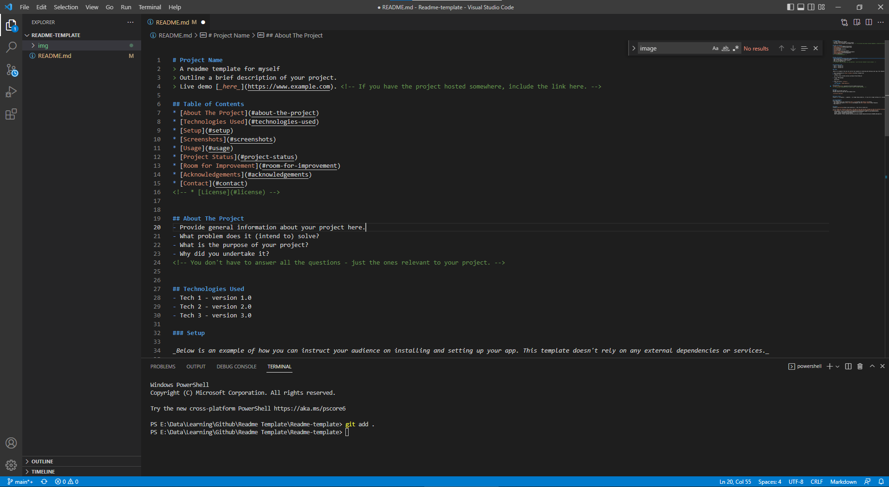

# Project Name
> A readme template for myself
> Outline a brief description of your project.
> Live demo [_here_](https://www.example.com). <!-- If you have the project hosted somewhere, include the link here. -->

## Table of Contents
* [About The Project](#about-the-project)
* [Technologies Used](#technologies-used)
* [Setup](#setup)
* [Screenshots](#screenshots)
* [Usage](#usage)
* [Project Status](#project-status)
* [Room for Improvement](#room-for-improvement)
* [Acknowledgements](#acknowledgements)
* [Contact](#contact)
<!-- * [License](#license) -->


## About The Project
- Provide general information about your project here.
- What problem does it (intend to) solve?
- What is the purpose of your project?
- Why did you undertake it?
<!-- You don't have to answer all the questions - just the ones relevant to your project. -->


## Technologies Used
- Tech 1 - version 1.0
- Tech 2 - version 2.0
- Tech 3 - version 3.0

### Setup

_Below is an example of how you can instruct your audience on installing and setting up your app. This template doesn't rely on any external dependencies or services._

1. Get a free API Key at [https://example.com](https://example.com)
2. Clone the repo
   ```sh
   git clone https://github.com/your_username_/Project-Name.git
   ```
3. Install NPM packages
   ```sh
   npm install
   ```
4. Enter your API in `config.js`
   ```js
   const API_KEY = 'ENTER YOUR API';

## Screenshots

<!-- If you have screenshots you'd like to share, include them here. -->


## Usage
How does one go about using it?
Provide various use cases and code examples here.

`write-your-code-here`


## Project Status
Project is: _in progress_ / _complete_ / _no longer being worked on_. If you are no longer working on it, provide reasons why.


## Acknowledgements
Give credit here.
- This readme project was inspired by [Rita Łyczywek][Rita] and [Othneil Drew][Drew]
- This project was based on [this tutorial][bulldogjob], [Best Readme Template][Best-Template] and [README-cheatsheet][readme-cheatsheet]
- [Markdown Cheatsheet][markdown-cheatsheet]
- Many thanks to...


## Contact
Created by [@flynerdpl](https://www.flynerd.pl/) - feel free to contact me!

[//]: # (These are reference links used in the body of this note and get stripped out when the markdown processor does its job. There is no need to format nicely because it shouldn't be seen. Thanks SO - http://stackoverflow.com/questions/4823468/store-comments-in-markdown-syntax)

[bulldogjob]: https://bulldogjob.com/readme/how-to-write-a-good-readme-for-your-github-project
[rita]: https://bulldogjob.com/readme/authors/rita-lyczywek
[Drew]: https://github.com/othneildrew
[Best-Template]: https://github.com/othneildrew/Best-README-Template/blob/master/README.md#readme-top
[markdown-cheatsheet]: https://github.com/adam-p/markdown-here/wiki/Markdown-Cheatsheet
[readme-cheatsheet]: https://github.com/ritaly/README-cheatsheet
